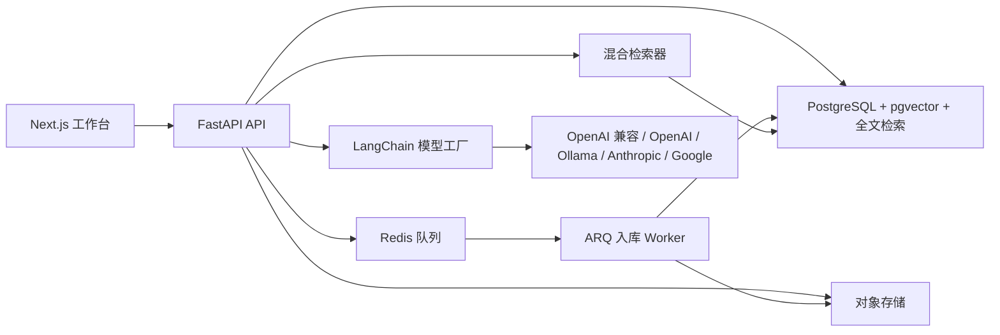

# Curx 系统设计清单

## 1. 产品边界

**决策：** Curx 是基于 AidBot 重构的、面向内部使用的“有证据支撑的知识问答平台”，不是一个通用的研究笔记本产品。

第一版必须做到：从受控知识中回答内部问题、展示支撑答案的来源分块、完整保留检索过程，并让运营人员能够定位低质量回答的原因。其他能力都服务于这条主链路。

## 2. 已核查的依据

- AidBot 已有会话持久化、`知识空间 -> 知识源 -> 文档 -> 分块` 的数据模型、聊天响应中的引用结构，以及一个按标题切片的本地检索原型。它的 `LangChainStrategy` 仍只是占位实现，因此 Curx 不应复制这层编排代码。
- 已检查 `mylandeng/open-notebook` 的提交 `8889087e317177d7b6e286342ab34e0c9c01d43e`（2026-07-03）。其中值得借鉴的是异步知识源处理、独立的来源向量记录、全文加向量搜索、上下文纳入控制、来源洞察和会话检查点。
- Open Notebook 是功能很宽的研究工作台，还包括播客制作、语音处理、复杂的 Provider 管理和富文本笔记编辑。这些能力并不是验证 Curx 核心价值的必要条件。

## 3. 架构决策

| 领域 | Curx 的决策 | 原因 |
| --- | --- | --- |
| 应用形态 | FastAPI 模块化单体 + ARQ 后台 Worker | 在不提前拆分分布式服务的前提下保留清晰边界。 |
| 主数据库 | PostgreSQL + `pgvector` + 内置全文检索 | 权限、文档、任务和向量统一放在同一个可事务化的数据源。 |
| 文件存储 | 兼容 S3 的对象存储；本地使用 MinIO | 原始文件必须与标准化文本分开保存。 |
| 队列 | Redis + ARQ | 解析和向量化不能阻塞上传接口。 |
| 检索 | 带权限过滤的混合检索：全文/BM25 + 向量，再做倒数排名融合 | 内部知识中大量存在故障码、型号和中文术语，仅用向量检索容易漏掉。 |
| 重排序 | 可选，置于 `Reranker` 接口之后 | 只有检索评测基线证明有必要时才引入。 |
| 回答流程 | 第一版用 LangChain Runnable；只有出现真实分支流程时才用 LangGraph | 固定的“检索 -> 回答 -> 引用”路径不需要图编排运行时。 |
| Provider 边界 | 内部维护小型 `ChatModelFactory` 和 `EmbeddingModelFactory` | 不让各家 SDK 的参数泄漏到领域模型和 API 合同中。 |
| 可观测性 | 从第一天记录结构化检索/回答日志；LangSmith 按环境可选 | 每次回答都需要可解释、可审计的运行轨迹。 |

## 4. 目标运行形态



Curx 需要维持一个稳定的 REST API 边界供 Next.js 前端调用。后端负责授权、可见性过滤、入库生命周期、检索、引用组装和模型选择；前端绝不能决定用户可检索哪些知识。

### LangChain 到 LangGraph 的平滑演进

Curx 现在使用 LangChain，不意味着未来被锁死在简单链式调用中。LangGraph 可以在后续作为回答工作流的编排运行时接入；它会复用既有的模型工厂、提示词、嵌入、检索器、向量库、引用组装和数据库模型。

但这不是只多安装几个包：LangGraph 增加了有状态节点、边、检查点、流式事件、重试和人工中断等运行语义。为避免日后大迁移，回答 API 只能依赖统一的 `AnswerWorkflow` 接口：

```text
Chat API
  -> AnswerWorkflow
      -> LinearRagWorkflow       # 当前：LangChain Runnable
      -> LangGraphRagWorkflow   # 后续：LangGraph 状态图
```

`LinearRagWorkflow` 与未来的 `LangGraphRagWorkflow` 都返回相同的 `AnswerResult` 和工作流事件。Graph 的 `State`、节点名称和 checkpoint 只能存在于工作流实现层，不得进入 API、领域模型或前端合同。因此迁移时替换的是编排实现，而不是知识库、会话、引用或前端页面。

以下任意场景出现两到三个时，再引入 LangGraph：问题改写/多知识空间路由、证据不足后的重检索或模型降级、来源校验、人工转交、长任务暂停恢复。第一条固定的“检索 -> 回答 -> 引用”链路不使用 LangGraph。

### 面向前端的回答工作流记录

当前 `retrieval_runs` 和 `citations` 已能保存检索轨迹和最终证据，但要在前端实时展示过程，还需增加一个稳定、脱离具体实现的事件合同。回答请求创建 `answer_runs`，执行中追加 `answer_run_events`，并用 SSE 推送给前端。

对前端公开的事件固定为：

```text
answer.started
query.understood
retrieval.started
evidence.ready
answer.generating
answer.completed
answer.failed
```

每个事件只包含状态、时间、可展示摘要、耗时、候选/证据数量和可安全暴露的来源 ID。前端据此呈现“理解问题 -> 检索资料 -> 提取证据 -> 生成回答”的时间线。不得把模型的原始思维过程、系统提示词、密钥或无权限的候选内容传给前端或写入普通日志。

无论当前是线性 LangChain 流程，还是未来迁移到 LangGraph，内部节点均映射到这同一组公开事件，前端无需随工作流实现变化而改版。

## 5. 知识索引：第一优先级

### 入库状态机

`queued -> extracting -> normalizing -> chunking -> embedding -> indexed`

终态包括 `failed`、`cancelled` 和 `superseded`。每次状态变更都要记录时间、尝试次数、错误码和可读错误信息。重新索引必须生成新的文档版本，不能篡改历史回答背后的证据。

### 入库流水线

1. 上传文件、粘贴 Markdown/HTML，或创建手工 FAQ；将原始字节写入对象存储，并计算内容哈希。
2. 使用来源对应的加载器提取文本：Markdown/纯文本、HTML、经 PyMuPDF 处理的 PDF、经 python-docx 处理的 DOCX；保留标题、来源 URL、语言、上传人和版本元数据。
3. 统一转换成标准 Markdown：清除不安全标记，保留标题、表格、列表、页边界和稳定的来源位置。
4. 先按标题层级切分，再对超长章节按 Token 切块，只在同一长章节内重叠；每一个块都写入标题路径、页码/位置、来源 ID、文档版本、可见性和标签。
5. 按选定的嵌入模型配置批量生成向量；每个向量都保存 Provider、模型名、维度和配置 ID。更换嵌入模型时必须显式重建索引，不能静默混用向量。
6. 为分块正文和元数据创建全文索引；只有全文索引和向量索引都成功完成后，文档版本才能标记为 `indexed`。

### 查询流水线

1. 识别调用方，并在检索前应用知识空间、来源、版本、可见性和标签过滤。
2. 使用完全相同的过滤条件，独立执行词法检索和向量检索。
3. 用倒数排名融合合并候选项，按来源做多样化，并保留各组成分数。
4. 只对少量候选项按需重排序，不能对全量知识库重排序。
5. 以固定分块 ID 和来源位置构建受 Token 预算约束的上下文包。
6. 仅依据这个上下文包生成答案；回答合同必须为每个支撑主张的分块返回引用、置信度，并在证据不足时返回 `handoff_required` 标识。

## 6. 数据模型清单

即使第一版只部署一个租户，也应当从一开始使用 UUID 主键并预留 `tenant_id`。

| 实体 | 核心字段 |
| --- | --- |
| `knowledge_spaces` | 租户、名称、可见性、所有者、状态 |
| `sources` | 知识空间、类型、标题、URI/对象键、内容哈希、元数据、可见性 |
| `documents` | 知识源、版本号、标准化 Markdown、语言、提取状态 |
| `chunks` | 文档版本、序号、内容、标题路径、位置、元数据、全文检索字段 |
| `embedding_profiles` | Provider、模型、维度、距离度量、启用标记 |
| `chunk_embeddings` | 分块、嵌入配置、向量、创建时间 |
| `ingestion_jobs` | 来源/版本、状态、尝试次数、进度、错误、关联 ID |
| `conversations` 和 `messages` | 操作人、知识空间范围、选用模型、不可变的回答元数据 |
| `answer_runs` | 消息、工作流版本、状态、开始/结束时间、关联 ID |
| `answer_run_events` | 回答运行、公开事件类型、可展示摘要、耗时、安全元数据 |
| `retrieval_runs` | 查询、过滤条件、候选分数、选中分块、耗时、模型配置 |
| `citations` | 消息、分块、顺序、分数、摘录、来源位置 |
| `feedback` | 消息、评分、原因、运营处理结果 |
| `users`、`sessions` | 已验证身份、租户、角色、最近登录时间、会话失效时间 |
| `access_keys`、`key_bindings` | 激活密钥哈希、生效/失效时间、额度/状态、绑定用户、可访问的知识空间、授权版本 |
| `audit_logs` | 密钥创建/撤销/绑定、管理员变更、授权失败和关键读取行为 |

**不可违反的约束：** 删除或被新版本替代的来源不得再被检索；但已授权的审计人员仍能通过历史引用定位到当时生成答案所使用的文档版本。

## 7. LangChain 与 Provider 策略

LangChain 提供的是统一接口，但各 Provider 的适配包仍需要显式安装。Curx 已安装首版所需适配器：

| 需求 | 首版适配器 |
| --- | --- |
| 默认云端模型及 OpenAI 兼容接口 | `langchain-openai`，通过 Provider、模型名和 Base URL 配置 |
| 本地/私有模型 | `langchain-ollama` |
| Anthropic | `langchain-anthropic` |
| Google | `langchain-google-genai` |
| 嵌入与向量持久化 | `langchain-postgres` + `pgvector` |

Provider 选择应实现为配置，而不是首版面向用户的平台功能：

- 初期在环境变量中定义默认聊天模型和嵌入模型配置。
- 密钥不得出现在聊天请求、知识源记录或应用日志中。
- `ModelProfile` 是领域记录，模型工厂负责将它转换为对应的 LangChain 集成对象。
- 聊天模型与嵌入模型相互独立；更换嵌入模型必须新建配置并执行显式重建索引任务。
- 只有权限策略允许时，第一版 UI 才提供受控的模型选择；不开放原始 API Key 和任意 Endpoint 输入。

### 管理员授权、激活密钥与登录

这个功能的页面交互并不复杂，但身份验证和密钥模型必须从第一版就做正确。需要严格区分两类密钥：

- **Curx 激活密钥：** 管理员创建并发给用户，用于获得 Curx 的租户和知识空间访问权。它不是模型 Provider 的 API Key。
- **Provider 凭据：** 平台代表租户调用 OpenAI、Ollama 或其他模型时使用的服务端密钥。它应由管理员安全配置在后端，绝不分发给普通用户。

推荐的首版用户路径是：管理员创建有生效时间、**失效时间**、可访问知识空间和限额的 Curx API Key；用户首次输入“绑定用户名 + API Key”，系统完成绑定并建立浏览器会话。后续在同一浏览器中，会话仍有效时直接按绑定用户名进入自己的知识问答页；会话过期或换设备后，再输入 API Key 登录。

激活密钥的过期必须真正控制访问权限，而不只是后台显示状态：`access_keys.expires_at` 或 `key_bindings.valid_until` 到期后，所有检索、聊天、上传和管理请求都拒绝执行。管理员撤销密钥时同样即时失效。会话令牌需带上授权版本，服务端每次请求检查绑定是否仍有效；撤销或过期时提升授权版本并使现有会话失效。可另有后台任务标记 `expired` 以便管理界面查询，但实际鉴权不能依赖后台任务是否及时执行。

API Key 在此方案中就是用户的登录凭据，等同于高强度密码：前端仅在首次登录或重新登录时提交，后端验证后换取 `HttpOnly`、`Secure` 的会话 Cookie，前端不得长期保存或再次展示 Key。Key 仅存哈希和前缀，明文只在管理员创建时展示一次；需要支持创建替换 Key、立即撤销 Key、失败尝试限流和审计记录。

仅输入用户名并不能单独完成登录，任何知道该用户名的人都可以冒充用户。用户名可用于查找账号、预填界面、显示当前用户，或在已有有效浏览器会话时快速进入；真正的授权凭据仍是 API Key 或可信的企业 SSO 会话。若未来接入企业 SSO，用户名可由企业身份自动带入，届时也可以实现真正的无感登录。

管理员后台的最小功能是创建、一次性展示、复制、查看状态、撤销和查看绑定记录；不需要一开始做复杂的 Provider 管理平台。激活密钥仅存哈希和前缀，明文只在创建时展示一次；绑定、撤销、登录失败和管理员操作全部写入审计日志。

## 8. Open Notebook 功能取舍

| Open Notebook 能力 | Curx 决策 | 理由 |
| --- | --- | --- |
| 多笔记本 | **现在引入，命名为知识空间** | 自然形成授权和内容边界。 |
| 文件上传、URL/文本输入、处理状态 | **现在引入** | 这是知识库运营的基础。 |
| 全文与向量搜索 | **现在引入，做成混合检索** | 可靠内部问答的必要能力。 |
| 来源感知聊天与引用 | **现在引入** | 核心信任合同，且与 AidBot 既有响应结构一致。 |
| 上下文包含/排除控制 | **第二阶段引入** | 知识空间中的来源变多后价值很高；现在先保留 API 过滤能力。 |
| 内容转换与来源洞察 | **有检索基线后再引入** | 仅在运营确有需求时先做摘要、FAQ 提取、关键词提取。 |
| 笔记 | **暂缓，但允许手工 FAQ 作为知识源类型** | 第一版不需要单独的笔记关系图。 |
| 跨笔记本复用来源 | **暂缓** | 会引入复杂的所有权、版本和删除语义。 |
| 单来源聊天 | **暂缓** | 初期普通的范围限定聊天已经覆盖该需求。 |
| Provider 配置 UI 与模型目录 | **暂缓** | 代码层适配已提供灵活性，无需立刻扩大安全与运维面。 |
| 音视频入库与转写 | **暂缓** | 成本高、异步链路长，且并非验证文本知识库的必要条件。 |
| 播客生成 | **不做** | 它不提升回答正确性或知识运营效率。 |
| MCP Server | **MVP 之后再评估** | 需等 REST 与授权领域合同稳定后才有价值。 |

## 9. 实施阶段与验收门槛

### 阶段 0：基础设施

- [x] 创建 Python 3.12 的 `uv` 环境并锁定依赖。
- [ ] 增加 FastAPI 配置、结构化日志、健康检查、数据库迁移，以及 PostgreSQL/pgvector、Redis、MinIO 的 Docker Compose。
- [ ] 建立目录结构：`src/curx/{api,core,domain,services,workers}` 和 `tests/{unit,integration,evaluation}`。
- [ ] 建立租户、用户、角色、会话、API Key、密钥绑定和审计日志模型；API Key 设置生效/失效时间并可立即撤销；首次/重新登录以“用户名 + API Key”换取安全浏览器会话。

**验收门槛：** `uv sync`、代码检查、类型检查、单元测试和干净的本地服务栈都能通过文档中的命令运行。

### 阶段 1：入库与索引

- [ ] 创建知识源、文档版本、分块、嵌入配置和任务的数据模型/迁移。
- [ ] 实现 Markdown、HTML、PDF、DOCX 和手工 FAQ 加载器。
- [ ] 实现状态机、重试策略、哈希去重、对象存储、层级切片、批量嵌入、全文检索和 pgvector 索引。
- [ ] 提供知识源列表/详情、上传、任务状态、重试和重新索引 API。

**验收门槛：** 样例语料可被上传并异步索引；重复重建索引后不会产生重复的活动分块。

### 阶段 2：有依据的 RAG 聊天

- [ ] 实现带过滤条件的混合检索器和检索运行记录。
- [ ] 实现回答 Runnable、引用组装器、证据不足响应和流式 API。
- [ ] 建立 `answer_runs` 与 `answer_run_events`，经 SSE 向前端推送稳定的回答进度事件。
- [ ] 有选择地迁移 AidBot 的会话与反馈合同，不能照搬它的本地 JSON 向量实现。

**验收门槛：** 每条回答要么包含有效且已持久化的引用，要么明确拒答；权限测试能够证明无权分块从不进入 Prompt。

### 阶段 3：质量与运营

- [ ] 增加带有期望来源分块和期望回答行为的评测语料。
- [ ] 计算 recall@k、引用准确率、基于证据的回答率、拒答准确率、延迟和入库失败率。
- [ ] 提供失败任务、知识新鲜度、反馈和检索轨迹的运营页面。

**验收门槛：** 每次引入重排序器或修改 Prompt 前，都必须有一组命名的评测集作为质量基线。

### 阶段 4：受控扩展

- [ ] 仅在评测数据支持的情况下，增加上下文包含/排除 UI、内容转换和可选重排序。
- [ ] 增加模型配置档案和受限模型选择器。
- [ ] 仅在 REST 和授权合同稳定后再考虑 MCP。

## 10. 第一版明确不做的事

- 不做播客或音频生成。
- 不做视频转写和通用多模态索引。
- 不做面向普通用户的多 Provider 密钥管理后台，也不分发第三方 Provider 的原始密钥。
- 不做能自主写入外部系统的 Agent。
- 不做跨知识空间的来源复用。
- 不因为已经安装了 LangGraph 就硬做图编排。

## 11. 下一步的实际开发顺序

1. 搭建 FastAPI 应用和本地服务栈。
2. 创建来源版本、任务、分块和嵌入配置的数据模型与迁移。
3. 交付一条垂直链路：Markdown 上传 -> 异步索引 -> 混合搜索 -> 带持久化引用的有依据回答。
4. 在扩展来源格式或加入重排序器之前，先建立检索评测样例。
